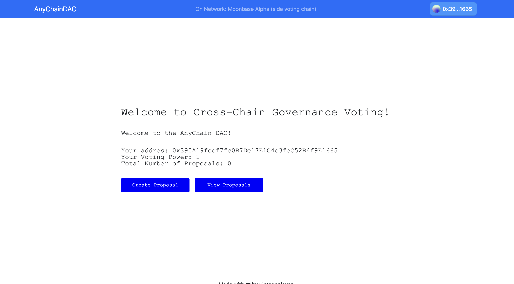
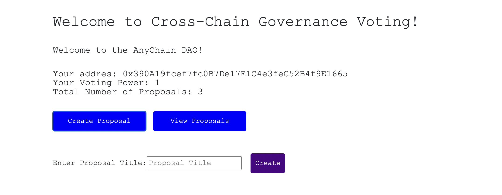
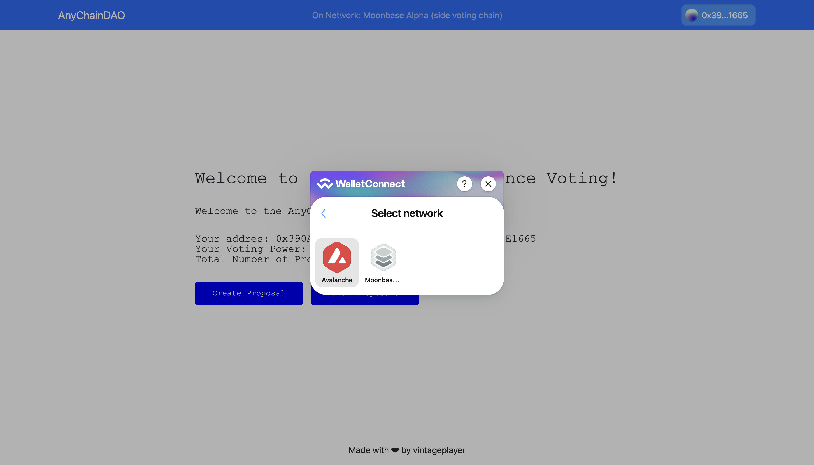
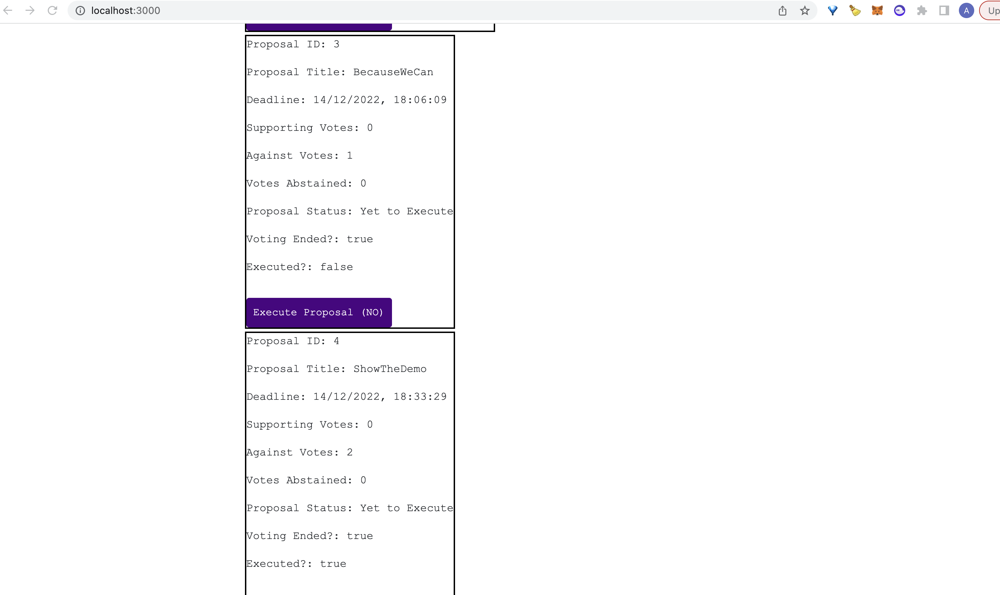

# Cross-Chain DAO Voting Using Moonbeam & LayerZero

Moonbean is EVM compatible and has a growing ecosystem of side-chains. on-chain DAO voting is good use leveraging benefits of both Moonbeam and LayerZero, and application with proven use rather than speculative demand.

## Bounty 1 - Product Idea Pitch
The PDF contains initial take on the cross-chain dao governance architecture. It does not explicitly mention parameters well-defined in compound and OpenZeppling governor and TimeLock standards. Rather gives details on the cross-chain communication during voting and execution of governance actions.

## Bounty 2 - Cross-Chain DAO Voting POC
A dapp for governance voting, where one-chain acts as the main chain (allowed to create proposals, end voting and execute the deciion) and side chains are available to cast votes.

## Architecture Decisions
- Proposal Life Cycle based actions are taken only on one chain, called the main chain.
- Voting happens independently in each chain as per the chain's specific voting rights of an address
- At the end of voting, vote count from all side chains are submitted to main chain for the final tally
- To improve UX, the next js api is used to relay the messages between chains
- End of voting requires a special relayer as a message from main chain is submitted to side chains to notify end of voting period, which triggers another message from the side chain sharing the vote count
- The relayer api is created to only load one side chain currently, though it can be easily modified to have any number of side votign chains
- As this a POC, voting power in each chain is set to 1 for a user. So the same address can cast vote per chain. In the limited time-frame, intension was to show the concept of cross-chain voting. The actual voting weightage can be integrated similar to Compound and OpenZepplin contracts.

### Screenshots

Home Page

Creating A Proposal

Selecting eligible network

Interacting With Proposals

## Challenges
The project took a lot of thought even to get to the POC stage. Understanding the technology, creating a voting process which is fair, creating a user experience close to single-chain usage.

There are many small areas to make it usage even for understanding, for eg:
 - The proposal state is currently not auto-refreshed
 - Handling of transaction failures due to unpredictable gas is not handled right now.
 - End of voting backend takes time to process which is not shown on frontend. (For 15-20 seconds, user doesn't know an operation is going on unless they look at the backend logs
 - Another confusing part is the votes shown, each chain should total votes at the moment, but that would need creation of cross-chain indexer. All these were out of scope given the tight timeline.
 - A user can vote only once (1 address = 1 vote per chain). But the frontend still shows an option to vote untill the deadline. The transaction will fail if the user tries to vote again.
 
